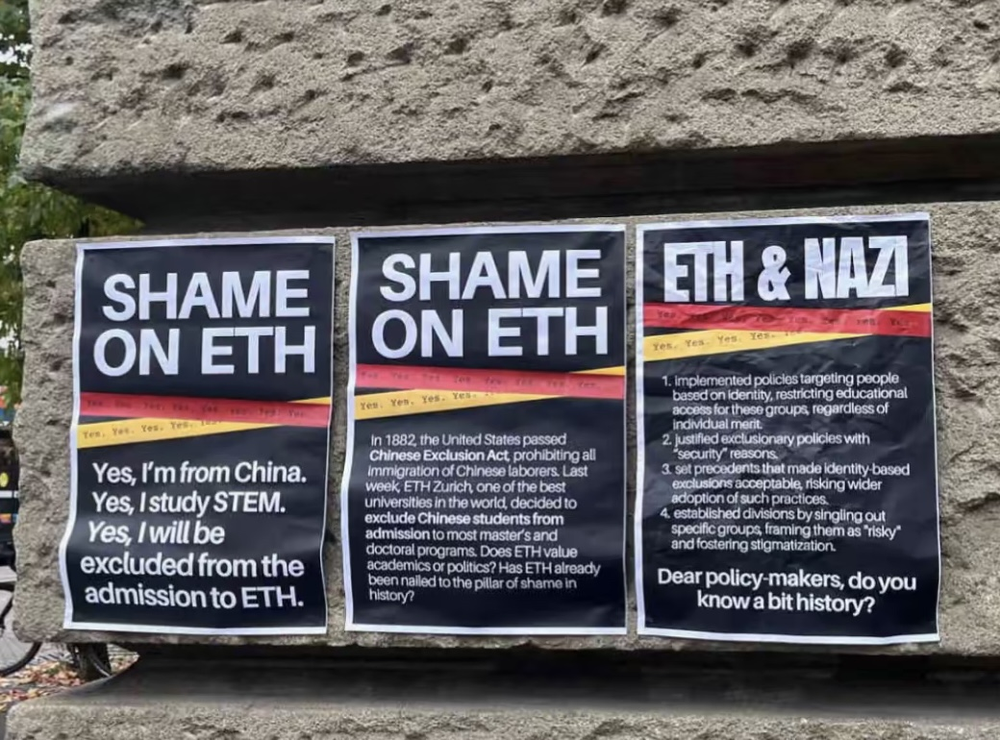

# Welcome to my homepage

## About Me

I am a post-doc at Chalmers Tekniska Högskola (from December 2024 to May 2025).

Previously, I was a post-doc at [IMJ-PRG](https://www.imj-prg.fr). My mentor was [Sébastien Boucksom](http://sebastien.boucksom.perso.math.cnrs.fr).
I obtained my PhD degree at [Chalmers Tekniska Högskola](https://www.chalmers.se/sv/Sidor/default.aspx) in Sweden under the supervision of Robert Berman.

My name in Chinese: 夏铭辰(Simplified)/夏銘辰(Traditional)

Email: <xiamingchen2008@gmail.com> My Chalmers email address (xiam@chalmers.se) is read only and loses around 50% of incoming emails. If you insist on sending emails there, please repeat doing so (at least) 7 times so that I have 99.22% chance of receiving them.

Office: H4031 (de jure).

Tags: [Pastafarianism](https://en.wikipedia.org/wiki/Flying_Spaghetti_Monster), anti-[Macronism](https://fr.wikipedia.org/wiki/Positions_politiques_d%27Emmanuel_Macron). ([Why?](France.md))

Currently I'm interested in the reverse Andreotti--Grauert theorems, quantum field theory and Swedish. Updated on Dec 18, 2024.

 *[Shame on ETH](https://www.reddit.com/r/ethz/comments/1gc2y1n/comment/ltqoboh/?utm_source=share&utm_medium=web3x&utm_name=web3xcss&utm_term=1&utm_content=share_button)*

## Some Problems

This is a collection of problems arising from my own research that may be of interest to people outside my domain.  If you know the solutions to any of the following problems, please let me know.

- [Flat pull-back of currents on complex analytic spaces](https://mathoverflow.net/questions/407628/regularity-of-fiber-integration-between-complex-analytic-spaces)

- [Compute mixed volumes of big line bundles from Okounkov bodies](https://mathoverflow.net/questions/408179/mixed-volumes-of-newton-okounkov-bodies)

> By [a theorem of Jow](https://arxiv.org/abs/0902.2521), information of all Okounkov bodies determines all numerical information of line bundles. This problem asks for explicit formulae.

## Notes

The lecture notes for courses can be found on [a separate page](lecture_notes.md).

- [LaTeX tips for working mathematicians](Notes/LaTeX_tips.pdf)

- [Relative pluripotential theory](Notes/RPT.pdf) (Chapter I to Chapter III)

> Just a preliminary version with potentially many mistakes. I'm slowly adding new materials.

- [Radial Calabi flow](Notes/RCF.pdf)  

> One of my unfinished projects. It contains a number of conjectures of interest.

- [Note on $L^2$-methods in global pluripotential theory](Notes/MIS.pdf)

> My personal notes when learning the $L^2$ methods, I plan to include more details in the future. This note contains an example of a reverse Bertini theorem, which seems to be new.

- [Note on relative normalisations](Notes/RN.pdf)

> I collect a few well-known results about relative normalisations.

- Notes on the toroidal compactifications of Shimura varieties: [I](Notes/SV1.pdf), [II](Notes/SV2.pdf), [III](Notes/SV3.pdf), [X](Notes/SV10.pdf), [XIII](Notes/SV13.pdf).

- Notes on Hodge theory: [Carlson's correspondence](Notes/Hodge1.pdf).

- [Operations on transcendental non-Archimedean metrics](https://bookstore.ams.org/view?ProductCode=CONM/810). [arXiv:2312.17150](https://arxiv.org/abs/2312.17150).

> This note is a trivial continuation of my joint paper with Darvas and Zhang. The only notable result is Theorem 4.21. 

- [Note on mixed volumes of currents](Notes/MV.pdf)

> I proved the equivalence between Cao's definition of mixed volumes and the definition using I-envelopes. A slightly different proof can be found in the first version of my paper on partial Okounkov bodies.

- [Non-pluripolar currents are not necessarily I-good](Notes/IGE.pdf)

> I construct a non-pluripolar qpsh function which is not I-good.  

## Beamers

- [Pluripotential-theoretic approach to radial energy functionals](Beamers/PTA.pdf)  Beijing university, 11/20/2020 (mm/dd/yyyy).

- [Analytic Bertini theorem](Beamers/ABT.pdf) Oslo SCV conference, 12/18/2021.

- [A mathematician’s complaint about Hermitian operators](Beamers/MC.pdf) A talk for physicists during an informal seminar, 12/10/2021.

- [The volume of pseudo-effective line bundles and partial Okounkov bodies](Beamers/VPPO.pdf)  YMSC Tsinghua university, 12/20/2021.

- [Chern--Weil formulae of singular Hermitian vector bundles](Beamers/CWF.pdf) Aarhus, 05/20/2022.

- [Les singularités $\mathcal{I}$-bonnes --- L'intersection entre la théorie analytique et la théorie algébrique](Beamers/IBS.pdf) IMJ-PRG, 01/03/2023.

- [A transcendental approach to non-Archimedean metrics](Beamers/TAnA.pdf) Göteborg, 05/04/2023.

- [Transcendental Okounkov bodies and the trace operator of currents](Beamers/TOB.pdf) Toulouse, 10/05/2023.

- [Singularities in global pluripotential theory](Beamers/SGPT.pdf) Kanazawa, 12/06/2023.

- [Partial Okounkov bodies and toric geometry](Beamers/POB.pdf) Cambridge, 05/17/2024.

- [A brief history of potential theory — From Poisson to Lelong](Beamers/HPT.pdf) Shanghai, 09/04/2024

## Ymir

[Ymir](https://mingchenxia.github.io/Ymir/) is intended to be a Stacks Project for complex analytic spaces and non-Archimedean analytic spaces.

## Research

>Errare humanum est.

All my preprints can be found on arXiv. See [my Google Scholar page](https://scholar.google.se/citations?user=1GbYhEMAAAAJ) as well.

### Works in progress

- [Transcendental b-divisors](Notes/TB.pdf)

> I establish a transcendental intersection theory of b-divisors, answering a question of Dang--Favre. Comments are welcome.

### K-stability

- On sharp lower bounds for Calabi type functionals and destabilizing properties of gradient flows, ***Analysis & PDE***, (2021).  [arXiv:1901.07889](https://arxiv.org/abs/1901.07889) [Journal link](https://msp.org/apde/2021/14-6/p12.xhtml)

> My note [Radial Calabi flow](Notes/RCF.pdf) might be of interest to the readers of this paper.

- Pluripotential-theoretic stability thresholds, ***IMRN***, (2022).  [arXiv:2012.12039](https://arxiv.org/abs/2012.12039) [Journal link](https://academic.oup.com/imrn/advance-article-abstract/doi/10.1093/imrn/rnac186/6644735)

> In arXiv version 1, Section 8, I briefly explained the second order expansion of Donaldson's L-functionals, which might be of interest as well.

### Pluripotential theory

- Integration by parts formula for non-pluripolar product.  [arXiv:1907.06359](https://arxiv.org/abs/1907.06359)

> This paper was the first proof of the integration by parts formula. However, a better approach was found later on by Lu, so this paper is no longer important. I don't intend to submit it.

- Mabuchi geometry of big cohomology classes with prescribed singularities, ***Journal für die reine und angewandte Mathematik***, (2023). [arXiv:1907.07234](https://arxiv.org/abs/1907.07234) [Journal link](https://www.degruyter.com/document/doi/10.1515/crelle-2023-0019/html)

>  There is a slight issue in the proof of Theorem 2.11 line 10:  $f^{\#}$ is only formally smooth, not smooth.  This does not affect anything in the proof. This is corrected in [this version](Papers/MG.pdf).

> As pointed out by Vasanth Pidaparthy and Prakhar Gupta, the statement of Proposition 4.12(ii) (Proposition 6.12(ii) in the arXiv version) is wrong in the generality as stated there,  one needs to assume that $\varphi_0\leq \gamma\leq \varphi_1$ in addition. This mistake does not affect the other parts of the paper.

> The published version contains only the special case without prescribed singularities on Kähler manifolds. The method in the general case is exactly the same.

- The closures of test configurations and algebraic singularity types, (joint with Tamás Darvas), ***Advances in Mathematics***, (2022).  [arXiv:2003.04818](https://arxiv.org/abs/2003.04818) [Journal link](https://www.sciencedirect.com/science/article/pii/S0001870822000147)

- The volume of pseudoeffective line bundles and partial equilibrium, (joint with Tamás Darvas), ***Geometry & Topology***, (2024). [arXiv:2112.03827](https://arxiv.org/abs/2112.03827) [Journal link](https://msp.org/gt/2024/28-4/p09.xhtml)

- Partial Okounkov bodies and Duistermaat--Heckman measures of non-Archimedean metrics. [arXiv:2112.04290](https://arxiv.org/abs/2112.04290)

- Non-pluripolar products on vector bundles and Chern--Weil formulae, ***Mathematische Annalen***, (2024). [arXiv:2210.15342](https://arxiv.org/abs/2210.15342) [Journal link](https://link.springer.com/article/10.1007/s00208-024-02838-4)

- Transcendental Okounkov bodies, (joint with Tamás Darvas, Rémi Reboulet, David Witt Nyström and Kewei Zhang). [arXiv:2309.07584](https://arxiv.org/abs/2309.07584)

- The trace operator of quasi-plurisubharmonic functions on compact Kähler manifolds, (joint with Tamás Darvas). [arXiv:2403.08259](https://arxiv.org/abs/2403.08259)

> A different point of view to the trace operator can be found in my lecture notes at Zhejiang university. Given the strong analogy with the usual trace opeartor, it is natural to ask if one could solve the Dirichlet problem for our trace operators: Is it possible to extend (in the sense of trace operators, up to I-equivalence) any Kähler current within a given big cohomology class?

### Non-Archimedean geometry and algebraic geometry

- On Liu morphisms in non-Archimedean geometry, ***Israel Journal of Mathematics, (2022)***. [arXiv:2106.08032](https://arxiv.org/abs/2106.08032) [Journal link](https://link.springer.com/article/10.1007/s11856-022-2456-6)

> In the complex analytic setting, very similar arguments (using Fréchet algebras instead of Banach algebras) give the notion of Stein morphisms. It is of interest to see if these morphisms are useful.

- Analytic Bertini theorem, ***Mathematische Zeitschrift***, (2022).  [arXiv:2110.14971](https://arxiv.org/abs/2110.14971) [Journal link](https://link.springer.com/article/10.1007/s00209-022-03103-7)

>  There is minor gap in the proof:  In the first step, one needs to further enlarge $\Sigma_1$ to make sure that the restriction ideal coincides with the pull-back as coherent sheaves. A corrected proof is presented in my lecture notes at Zhejiang University. 

- A transcendental approach to non-Archimedean metrics of pseudoeffective classes, (joint with Tamás Darvas and Kewei Zhang). [arXiv:2302.02541](https://arxiv.org/abs/2302.02541)

> The theory of non-Archimedean psh functions we developed in this paper trivally satisfies Boucksom--Jonsson's envelope conjecture (even on a general unibranch complex space), see my note [Operations on transcendental non-Archimedean metrics](Notes/OTNA.pdf).

## My favourite links

### Legal links

- [Online math seminars](https://researchseminars.org)

- [Tikz-cd editor](https://tikzcd.yichuanshen.de)

- [Quiver](https://q.uiver.app)

- [Stacks Project](https://stacks.math.columbia.edu)

- [Kerodon](https://kerodon.net)

- [Almost Sure](https://almostsuremath.com)

- [MacTutor](https://mathshistory.st-andrews.ac.uk)

### Illegal links

- [ZLibrary](https://z-library.sk)

> Updated on Nov 8, 2024.

- [Libgen](http://gen.lib.rus.ec)

> If you hate Elsevier or like free knowledge, please download books from these links.

- [Sci-hub](http://sci-hub.vkif.top)

> Sci-hub is getting blocked in many countries recently. If the link fails to work, please try to change the domain name.
