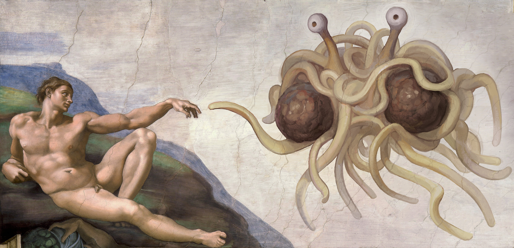

# Welcome to my homepage

## About Me

I am now a post-doc at [IMJ-PRG](https://www.imj-prg.fr). My mentor is [Sébastien Boucksom](http://sebastien.boucksom.perso.math.cnrs.fr).
I obtained my PhD in [Chalmers Tekniska Högskola](https://www.chalmers.se/sv/Sidor/default.aspx) in Sweden under the supervision of Robert Berman.

My name in Chinese: 夏铭辰(Simplified)/夏銘辰(Traditional)

Email: <mingchen@imj-prg.fr>

Office: Jussieu 1516-504.

I'm learning Katz--Mazur. Updated on November 6, 2022.

## Some Problems

This is a collection of problems arising from my own research that may be of interest to people outside my domain.  If you know the solutions to any of the following problems, please let me know.

- [Flat pull-back of currents on complex analytic spaces](https://mathoverflow.net/questions/407628/regularity-of-fiber-integration-between-complex-analytic-spaces)

- [Compute mixed volumes of big line bundles from Okounkov bodies](https://mathoverflow.net/questions/408179/mixed-volumes-of-newton-okounkov-bodies)

> By [a theorem of Jow](https://arxiv.org/abs/0902.2521), information of all Okounkov bodies determines all numerical information of line bundles. This problem asks for explicit formulae.

## Notes

- [Relative pluripotential theory](Notes/RPT.pdf) (Chapter I to Chapter III)

> Just a preliminary version with potentially many mistakes. I'm slowly adding new materials.

- [Radial Calabi flow](Notes/RCF.pdf)  

> One of my unfinished projects. It contains a number of conjectures of interest.

- [Pluripotential theory on complex analytic spaces](Notes/PTV.pdf)

> This is not a research article. I simply want to provide a reference for my work in progress about pluripotential theory on polyhedral spaces.

- [Note on $L^2$-methods in global pluripotential theory](Notes/MIS.pdf)

> My personal notes when learning the $L^2$ methods, I plan to include more details in the future. This note contains an example of a reverse Bertini theorem, which seems to be new.

- [Note on relative normalisations](Notes/RN.pdf)

> I collect a few well-known results about relative normalisations.

- Notes on the toroidal compactifications of Shimura varieties: [I](Notes/SV1.pdf), [II](Notes/SV2.pdf), [III](Notes/SV3.pdf), [X](Notes/SV10.pdf), [XIII](Notes/SV13.pdf).

> I'm organizing a seminar about Ash--Mumford--Rapoport--Tai. I will try to write more notes in the near future.

- Notes on Katz--Mazur [I](Notes/KM1.pdf).

> My personal notes on Katz--Mazur. I want to refomulate everything in the language of stacks.

- [Hausdorff convergence properties of partial Okounkov bodies](Notes/HCP.pdf).

> I fully answered the conjecture in my paper about partial Okounkov boides.

## Beamers

- [Pluripotential-theoretic approach to radial energy functionals](Beamers/PTA.pdf)  Beijing university, 11/20/2020.

- [Analytic Bertini theorem](Beamers/ABT.pdf) Oslo SCV conference, 12/18/2021.

- [A mathematician’s complaint about Hermitian operators](Beamers/MC.pdf) A talk for physicists during an informal seminar, 12/10/2021.

- [The volume of pseudo-effective line bundles and partial Okounkov bodies](Beamers/VPPO.pdf)  YMSC Tsinghua university, 12/20/2021.

- [Chern--Weil formulae of singular Hermitian vector bundles](Beamers/CWF.pdf) Aarhus, 05/20/2022.

- [Les singularités $\mathcal{I}$-bonnes --- L'intersection entre la théorie analytique et la théorie algébrique](Beamers/IBS.pdf) IMJ-PRG, 01/03/2023.

## Ymir

[Ymir](https://mingchenxia.github.io/Ymir/) is intended to be a Stacks Project for complex analytic spaces and non-Archimedean analytic spaces.

## Research

> Errare humanum est.

All of my preprints can be found on arXiv. See [my Google Scholar page](https://scholar.google.se/citations?user=1GbYhEMAAAAJ) as well.

### K-stability

- On sharp lower bounds for Calabi type functionals and destabilizing properties of gradient flows, ***Analysis & PDE***, (2021).  [arXiv:1901.07889](https://arxiv.org/abs/1901.07889) [Journal link](https://msp.org/apde/2021/14-6/p12.xhtml)

- Pluripotential-theoretic stability thresholds, ***IMRN***, (2022).  [arXiv:2012.12039](https://arxiv.org/abs/2012.12039) [Journal link](https://academic.oup.com/imrn/advance-article-abstract/doi/10.1093/imrn/rnac186/6644735)

### Pluripotential theory

- Integration by parts formula for non-pluripolar product.  [arXiv:1907.06359](https://arxiv.org/abs/1907.06359)

> This paper was the first proof of the integration by parts formula. However, a better approach was found later on by Lu, so this paper is no longer important. I don't intend to submit it.

- Mabuchi geometry of big cohomology classes with prescribed singularities. [arXiv:1907.07234](https://arxiv.org/abs/1907.07234)

- The closures of test configurations and algebraic singularity types, (joint with Tamás Darvas), ***Advances in Mathematics***, (2022).  [arXiv:2003.04818](https://arxiv.org/abs/2003.04818) [Journal link](https://www.sciencedirect.com/science/article/pii/S0001870822000147)

- The volume of pseudoeffective line bundles and partial equilibrium, (joint with Tamás Darvas). [arXiv:2112.03827](https://arxiv.org/abs/2112.03827)

- Partial Okounkov bodies and Duistermaat--Heckman measures of non-Archimedean metrics. [arXiv:2112.04290](https://arxiv.org/abs/2112.04290)

> [This](/Papers/POB.pdf) is a slightly better version than the arXiv version. Several typos are fixed, and one additional reference is added. There is a slight mistake in the arXiv version: In Section 4, the standing hypothesis should be that the classes are big instead of pseudo-effective.

> The Hausdorff convergence property is proved in full generality in my note [Hausdorff convergence properties of partial Okounkov bodies](Notes/HCP.pdf).

### Non-Archimedean geometry and algebraic geometry

- On Liu morphisms in non-Archimedean geometry, ***Israel Journal of Mathematics, (2022)***. [arXiv:2106.08032](https://arxiv.org/abs/2106.08032) [Journal link](https://link.springer.com/article/10.1007/s11856-022-2456-6)

- Analytic Bertini theorem, ***Mathematische Zeitschrift***, (2022).  [arXiv:2110.14971](https://arxiv.org/abs/2110.14971) [Journal link](https://link.springer.com/article/10.1007/s00209-022-03103-7)

### Number theory

- Non-pluripolar products on vector bundles and Chern--Weil formulae on mixed Shimura varieties. [arXiv:2210.15342](https://arxiv.org/abs/2210.15342)

## Links for working mathematicians

### Legal links

- [Online math seminars](https://researchseminars.org)

- [Tikz-cd editor](https://tikzcd.yichuanshen.de)

- [Quiver](https://q.uiver.app)

- [Stacks Project](https://stacks.math.columbia.edu)

- [Kerodon](https://kerodon.net)

### Illegal links

- [ZLibrary](https://b-ok.org)

> Taken down by the US government. R.I.P.

- [Libgen](http://gen.lib.rus.ec)

> If you hate Elsevier or like free knowledge, please download books from these links.

- [Sci-hub](https://sci-hub.se)

> Sci-hub is getting blocked in many countries recently. If the link fails to work, please try to change the domain name.
